# [TÊN TRƯỜNG]
## [TÊN KHOA/BỘ MÔN]

# BÁO CÁO ĐỒ ÁN

## HỆ THỐNG THUYẾT MINH TỰ ĐỘNG ĐA NGÔN NGỮ CHO ẨM THỰC VĨNH KHÁNH

**Môn học:** [Tên môn học]

**Giảng viên hướng dẫn:** [Họ tên GVHD]

**Sinh viên thực hiện:** [Họ tên sinh viên]

**Mã số sinh viên:** [MSSV]

**Lớp:** [Lớp]

**Năm học:** 2025-2026


<div class="page-break"></div>

# LỜI CẢM ƠN

Em xin chân thành cảm ơn Quý Thầy/Cô đã hướng dẫn và góp ý trong quá trình thực hiện đồ án. Em cũng cảm ơn bạn bè và người dùng thử đã hỗ trợ kiểm tra các luồng app, web và API. Những góp ý này giúp em hoàn thiện hệ thống theo hướng thực tế hơn, đồng thời hiểu rõ hơn cách thiết kế một sản phẩm phần mềm có nhiều thành phần liên kết.

Do thời gian và phạm vi đồ án có giới hạn, báo cáo tập trung mô tả đúng những chức năng đã thể hiện trong source code hiện tại, đồng thời ghi nhận trung thực các hạn chế và hướng phát triển tiếp theo.


<div class="page-break"></div>

# NHẬN XÉT CỦA GIẢNG VIÊN


................................................................................................................................................................................................................................................................................................................................................................................................................................................................................................................................................................................................................................................................................................................................................................................................................................................................................................................................................................................................................................................................................................................................................................................................................................


<div class="page-break"></div>

# MỤC LỤC

- [LỜI CẢM ƠN](#lời-cảm-ơn)
- [NHẬN XÉT CỦA GIẢNG VIÊN](#nhận-xét-của-giảng-viên)
- [DANH MỤC HÌNH ẢNH](#danh-mục-hình-ảnh)
- [DANH MỤC BẢNG BIỂU](#danh-mục-bảng-biểu)
- [DANH MỤC TỪ VIẾT TẮT](#danh-mục-từ-viết-tắt)
- [CHƯƠNG 1. TỔNG QUAN ĐỀ TÀI](#chương-1.-tổng-quan-đề-tài)
  - [1.1. Lý do chọn đề tài](#1.1.-lý-do-chọn-đề-tài)
  - [1.2. Mục tiêu đề tài](#1.2.-mục-tiêu-đề-tài)
  - [1.3. Đối tượng sử dụng](#1.3.-đối-tượng-sử-dụng)
  - [1.4. Phạm vi đề tài](#1.4.-phạm-vi-đề-tài)
  - [1.5. Phương pháp thực hiện](#1.5.-phương-pháp-thực-hiện)
- [CHƯƠNG 2. CƠ SỞ LÝ THUYẾT VÀ CÔNG NGHỆ SỬ DỤNG](#chương-2.-cơ-sở-lý-thuyết-và-công-nghệ-sử-dụng)
  - [2.1. ASP.NET Core Web API](#2.1.-asp.net-core-web-api)
  - [2.2. ASP.NET Core MVC](#2.2.-asp.net-core-mvc)
  - [2.3. .NET MAUI](#2.3.-.net-maui)
  - [2.4. JSON Repository](#2.4.-json-repository)
  - [2.5. SQLite/offline cache trong app](#2.5.-sqliteoffline-cache-trong-app)
  - [2.6. GPS và Geofence](#2.6.-gps-và-geofence)
  - [2.7. Text-to-Speech và Audio Guide](#2.7.-text-to-speech-và-audio-guide)
  - [2.8. QR Code và Deep Link](#2.8.-qr-code-và-deep-link)
  - [2.9. Authentication, Authorization, Role-based Access Control](#2.9.-authentication-authorization-role-based-access-control)
  - [2.10. Analytics](#2.10.-analytics)
- [CHƯƠNG 3. PHÂN TÍCH YÊU CẦU HỆ THỐNG](#chương-3.-phân-tích-yêu-cầu-hệ-thống)
  - [3.1. Yêu cầu chức năng](#3.1.-yêu-cầu-chức-năng)
    - [A. App MAUI](#a.-app-maui)
    - [B. WebAdmin](#b.-webadmin)
    - [C. Backend API](#c.-backend-api)
  - [3.2. Yêu cầu phi chức năng](#3.2.-yêu-cầu-phi-chức-năng)
  - [3.3. Actor hệ thống](#3.3.-actor-hệ-thống)
  - [3.4. Use Case tổng thể](#3.4.-use-case-tổng-thể)
  - [3.5. Đặc tả Use Case chi tiết](#3.5.-đặc-tả-use-case-chi-tiết)
- [CHƯƠNG 4. THIẾT KẾ HỆ THỐNG](#chương-4.-thiết-kế-hệ-thống)
  - [4.1. Kiến trúc tổng thể](#4.1.-kiến-trúc-tổng-thể)
  - [4.2. Thiết kế phân quyền](#4.2.-thiết-kế-phân-quyền)
  - [4.3. Thiết kế dữ liệu](#4.3.-thiết-kế-dữ-liệu)
  - [4.4. Thiết kế API](#4.4.-thiết-kế-api)
  - [4.5. Thiết kế App MAUI](#4.5.-thiết-kế-app-maui)
  - [4.6. Thiết kế WebAdmin](#4.6.-thiết-kế-webadmin)
  - [4.7. Thiết kế Sequence Diagram](#4.7.-thiết-kế-sequence-diagram)
- [CHƯƠNG 5. TRIỂN KHAI HỆ THỐNG](#chương-5.-triển-khai-hệ-thống)
  - [5.1. Cấu trúc source code](#5.1.-cấu-trúc-source-code)
  - [5.2. Triển khai Backend API](#5.2.-triển-khai-backend-api)
  - [5.3. Triển khai WebAdmin](#5.3.-triển-khai-webadmin)
  - [5.4. Triển khai App MAUI](#5.4.-triển-khai-app-maui)
  - [5.5. Một số đoạn xử lý tiêu biểu](#5.5.-một-số-đoạn-xử-lý-tiêu-biểu)
- [CHƯƠNG 6. KIỂM THỬ VÀ ĐÁNH GIÁ](#chương-6.-kiểm-thử-và-đánh-giá)
  - [6.1. Môi trường kiểm thử](#6.1.-môi-trường-kiểm-thử)
  - [6.2. Test case chức năng](#6.2.-test-case-chức-năng)
  - [6.3. Đánh giá kết quả](#6.3.-đánh-giá-kết-quả)
  - [6.4. Hạn chế hiện tại](#6.4.-hạn-chế-hiện-tại)
- [CHƯƠNG 7. KẾT LUẬN VÀ HƯỚNG PHÁT TRIỂN](#chương-7.-kết-luận-và-hướng-phát-triển)
  - [7.1. Kết luận](#7.1.-kết-luận)
  - [7.2. Hướng phát triển](#7.2.-hướng-phát-triển)
- [PHỤ LỤC](#phụ-lục)
  - [Phụ lục A. API Matrix đầy đủ](#phụ-lục-a.-api-matrix-đầy-đủ)
  - [Phụ lục B. Danh sách file/class quan trọng](#phụ-lục-b.-danh-sách-fileclass-quan-trọng)
  - [Phụ lục C. Dữ liệu mẫu POI/Tour](#phụ-lục-c.-dữ-liệu-mẫu-poitour)
  - [Phụ lục D. Hướng dẫn chạy demo](#phụ-lục-d.-hướng-dẫn-chạy-demo)
  - [Phụ lục E. Checklist đối chiếu PRD - Code](#phụ-lục-e.-checklist-đối-chiếu-prd---code)


<div class="page-break"></div>

# DANH MỤC HÌNH ẢNH

- Hình 1. Use case tổng thể
- Hình 2. Kiến trúc tổng thể App/WebAdmin/API/JSON Repository
- Hình 3. ERD logic của hệ thống
- Hình 4. WEB-01. Đăng nhập, phân quyền và đăng xuất
- Hình 5. WEB-02. Dashboard tổng quan và realtime active devices
- Hình 6. WEB-03. Admin quản lý POI
- Hình 7. WEB-04. Quản lý Audio Guide/TTS
- Hình 8. WEB-05. Quản lý Tour
- Hình 9. WEB-06. Quản lý QR public cho POI/Tour
- Hình 10. WEB-07. Public QR scan, mô phỏng device profile và ghi analytics
- Hình 11. WEB-08. Map Analytics
- Hình 12. WEB-09. Owner Portal đăng ký POI
- Hình 13. WEB-10A. AdminUsersController quản lý tài khoản WebAdmin
- Hình 14. WEB-10B. SystemAdminController quản lý App User/Profile
- Hình 15. WEB-11. Translation scripts
- Hình 16. APP-01. Mở app, chọn ngôn ngữ và Guest Mode
- Hình 17. APP-02. Load POI/Tour từ API, fallback offline/cache/seed
- Hình 18. APP-03. GPS/geofence auto narration
- Hình 19. APP-04. Nghe POI thủ công
- Hình 20. APP-05. Chọn tour và bản đồ chỉ hiện POI thuộc tour
- Hình 21. APP-06. Quét QR mở POI/Tour
- Hình 22. APP-07. Listening history begin/complete/delete
- Hình 23. APP-08. Active device heartbeat và movement log
- Hình 24. APP-09. Offline cache/audio cache
- Hình 25. APP-10. Auth/Profile sync

# DANH MỤC BẢNG BIỂU

- Bảng 1. Đối tượng sử dụng hệ thống
- Bảng 2. Actor, quyền và code liên quan
- Bảng 3. UC-01 - Đăng nhập WebAdmin
- Bảng 4. UC-02 - Admin tạo/sửa/xóa POI
- Bảng 5. UC-03 - Owner đăng ký POI mới
- Bảng 6. UC-04 - Admin duyệt POI Owner gửi
- Bảng 7. UC-05 - Admin tạo/sửa Tour
- Bảng 8. UC-06 - App chọn tour và đi theo tour
- Bảng 9. UC-07 - App tự động thuyết minh GPS/geofence
- Bảng 10. UC-08 - App/Web quét QR
- Bảng 11. UC-09 - Ghi listening history
- Bảng 12. UC-10 - Dashboard analytics
- Bảng 13. Thiết kế phân quyền
- Bảng 14. API Matrix rút gọn theo route thật
- Bảng 15. Thành phần thiết kế App MAUI
- Bảng 16. Thành phần thiết kế WebAdmin
- Bảng 17. Cấu trúc source code
- Bảng 18. Các luồng xử lý tiêu biểu
- Bảng 19. Test case chức năng
- Bảng 20. File/class quan trọng
- Bảng 21. POI active trong `pois.json`
- Bảng 22. Tour active trong `tours.json`
- Bảng 23. Checklist đối chiếu PRD - Code

# DANH MỤC TỪ VIẾT TẮT

| Từ viết tắt | Diễn giải |
| --- | --- |
| API | Application Programming Interface |
| POI | Point of Interest |
| TTS | Text-to-Speech |
| QR | Quick Response Code |
| CMS | Content Management System |
| MVC | Model View Controller |
| MAUI | Multi-platform App UI |
| JSON | JavaScript Object Notation |
| DTO | Data Transfer Object |
| GPS | Global Positioning System |
| RBAC | Role-based Access Control |


<div class="page-break"></div>

# CHƯƠNG 1. TỔNG QUAN ĐỀ TÀI

## 1.1. Lý do chọn đề tài

Phố ẩm thực Vĩnh Khánh là một không gian ăn uống đông khách, có nhiều quán hải sản, lẩu, nướng và món đường phố nằm gần nhau. Với khách du lịch hoặc người lần đầu đến khu vực này, việc chọn quán, hiểu món nổi bật, tìm đường và nghe giới thiệu theo ngôn ngữ phù hợp là nhu cầu thực tế.

Đề tài lựa chọn hướng thuyết minh tự động vì kết hợp được bản đồ, GPS/geofence, QR code, nội dung đa ngôn ngữ và quản trị nội dung tập trung. Hệ thống gồm App MAUI cho khách tham quan, WebAdmin MVC cho quản trị/chủ quán và Backend API dùng chung dữ liệu JSON để phục vụ demo học thuật.

## 1.2. Mục tiêu đề tài

- Xây dựng app Android cho phép khách chọn ngôn ngữ, xem bản đồ, xem danh sách POI, nghe thuyết minh thủ công hoặc tự động khi vào vùng geofence.
- Xây dựng WebAdmin để quản lý POI, tour, audio guide/TTS, bản dịch, QR public, dashboard, usage logs, tài khoản WebAdmin và hồ sơ app user.
- Xây dựng Backend API ASP.NET Core cung cấp dữ liệu POI/tour/audio/QR/analytics và lưu bằng JSON repository trong `VKFoodAPI/App_Data`.
- Hỗ trợ owner portal để chủ cửa hàng xem POI liên quan, xem lịch sử nghe và gửi đăng ký POI mới chờ duyệt.
- Thiết kế app có khả năng fallback khi API lỗi thông qua SQLite offline snapshot, cached snapshot và seed data.

## 1.3. Đối tượng sử dụng

**Bảng 1. Đối tượng sử dụng hệ thống**

| Đối tượng | Mục đích sử dụng | Module chính |
| --- | --- | --- |
| Guest/Tourist | Vào app không cần đăng nhập, chọn ngôn ngữ, xem bản đồ, nghe thuyết minh, quét QR. | VinhKhanhGuide.App |
| App user | Đăng ký/đăng nhập local trong app, lưu hồ sơ, đồng bộ profile và lịch sử nghe. | AuthService, UserProfileSyncService |
| Admin | Quản trị nội dung, dashboard, POI, tour, audio/TTS, QR, translation, tài khoản và app users. | CTest.WebAdmin |
| Owner/chủ cửa hàng | Xem POI của mình, theo dõi lịch sử nghe, đăng ký POI mới chờ duyệt. | OwnerController |
| Public QR visitor | Mở trang QR public từ trình duyệt, nghe nội dung hoặc mở app bằng deep link. | QrCodesController.Scan |

## 1.4. Phạm vi đề tài

Đến thời điểm đọc source, dữ liệu demo có 11 POI active, 2 tour active, 4 audio guide, 12 QR item API, 24 bản ghi listening history, 0 active device session, 967 movement log và 9 user profile.

- Phần đã triển khai: public API đọc POI/tour, admin API có `X-Admin-Api-Key`, WebAdmin có cookie auth và role Admin/PoiOwner, app có map, POI, tour, QR, GPS/geofence, TTS/audio, history, offline cache và heartbeat.
- Phần cần ghi trung thực: hệ thống dùng JSON repository phù hợp demo/học thuật, chưa phải cơ sở dữ liệu production; WebAdmin QR hiện tạo/in QR public động từ POI/Tour, chưa có màn CRUD độc lập cho `qr-codes.json`; audio playback hiện là cancel/replace kết hợp debounce/cooldown, chưa có hàng đợi âm thanh phức tạp.
- Bộ chọn ngôn ngữ hiện dùng `vi/en/zh/ja/de` trong WebAdmin Translation và app. Tuy vậy dữ liệu JSON hiện còn key lịch sử `ko/fr`, repository vẫn giữ để đọc an toàn; cần rà soát lại nội dung bản dịch trước triển khai thật.
- Public QR web có `DeviceCapabilitySimulation` theo yêu cầu giảng viên: `0 = thiết bị mạnh`, `1 = thiết bị yếu`; đây là mô phỏng random 0/1 hoặc ép bằng query string, chưa phải đo cấu hình thiết bị thật.

## 1.5. Phương pháp thực hiện

1. Phân tích yêu cầu từ PRD và luồng người dùng: khách tham quan, admin, owner, public QR visitor.
2. Thiết kế kiến trúc 3 khối App MAUI, WebAdmin MVC và Backend API dùng DTO chung trong `VinhKhanhGuide.Core`.
3. Thiết kế dữ liệu theo mô hình logic, sau đó lưu vật lý bằng JSON repository và SQLite cache trong app.
4. Triển khai API controller/repository, WebAdmin controller/service/API client và app ViewModel/service.
5. Kiểm thử theo use case: login, CRUD POI, tour, QR, GPS auto narration, listening history, dashboard và offline fallback.

# CHƯƠNG 2. CƠ SỞ LÝ THUYẾT VÀ CÔNG NGHỆ SỬ DỤNG

## 2.1. ASP.NET Core Web API

ASP.NET Core Web API được dùng cho `VKFoodAPI`. Controller trả JSON DTO, public endpoint phục vụ app/QR, còn endpoint quản trị dùng policy `AdminApiKey`. Swagger được cấu hình trong môi trường Development.

## 2.2. ASP.NET Core MVC

ASP.NET Core MVC được dùng cho `CTest.WebAdmin`. Mô hình controller-service-view giúp tách nghiệp vụ quản trị khỏi giao diện Razor. WebAdmin còn host các API controller của `VKFoodAPI` qua `AddApplicationPart`, thuận tiện cho demo một tiến trình.

## 2.3. .NET MAUI

App dùng .NET MAUI target `net8.0-android`, kết hợp XAML page, `MainViewModel`, Mapsui, ZXing.Net.Maui, TextToSpeech và Android MediaPlayer. Đây là hướng phù hợp để xây dựng app bản đồ và thuyết minh trên Android.

## 2.4. JSON Repository

JSON repository là cách lưu dữ liệu đơn giản bằng file như `pois.json`, `tours.json`, `audio-guides.json`. Cách này dễ demo, dễ kiểm tra diff, nhưng không thay thế được database quan hệ khi có đồng thời nhiều người dùng hoặc yêu cầu transaction phức tạp.

## 2.5. SQLite/offline cache trong app

`PoiOfflineStore` tạo SQLite `vinhkhanh_guide.db` với bảng `poi_cache` và `sync_metadata`. Khi API lỗi, app ưu tiên đọc SQLite snapshot, sau đó cached snapshot trong bộ nhớ, cuối cùng mới dùng seed data.

## 2.6. GPS và Geofence

`LocationService` lấy vị trí thiết bị. `GeofenceEngine` tính khoảng cách từ vị trí hiện tại đến từng POI bằng `GeoMath.DistanceMeters`, sau đó so với `TriggerRadiusMeters` để xác định người dùng đã vào vùng kích hoạt hay chưa.

## 2.7. Text-to-Speech và Audio Guide

`NarrationService` dùng MAUI TextToSpeech cho TTS và Android `MediaPlayer` cho file audio. `AudioGuideRepository` đồng bộ audio/TTS đã publish vào POI để app có thể phát theo `NarrationTranslations` hoặc `AudioAssetPath`.

## 2.8. QR Code và Deep Link

WebAdmin dùng QRCoder tạo QR public `/qr/{targetType}/{targetId}`. App dùng camera ZXing hoặc nhập mã thủ công, gọi `GET /api/resolve-qr?code=...` và xử lý deep link `vinhkhanhguide://poi/...` hoặc `vinhkhanhguide://tour/...`.

## 2.9. Authentication, Authorization, Role-based Access Control

WebAdmin dùng Cookie Authentication, role `Admin` và `PoiOwner`. API quản trị dùng `X-Admin-Api-Key`. App hiện có guest mode và local auth bằng Preferences, đồng bộ profile lên API nhưng chưa phải hệ thống JWT/OAuth production.

## 2.10. Analytics

Analytics gồm listening history, active devices và movement logs. Listening history ghi begin/complete lượt nghe; active device heartbeat cập nhật phiên thiết bị; movement log ghi điểm di chuyển hợp lệ khi heartbeat có tọa độ.

# CHƯƠNG 3. PHÂN TÍCH YÊU CẦU HỆ THỐNG

## 3.1. Yêu cầu chức năng

### A. App MAUI

- Chọn ngôn ngữ `vi/en/zh/ja/de` trước khi vào app; lưu cài đặt giọng đọc và mode `tts/audio`.
- Guest mode, đăng ký/đăng nhập local app user, cập nhật hồ sơ và đồng bộ profile lên API.
- Xem bản đồ, danh sách POI, chi tiết POI, nhóm món nổi bật và tìm kiếm.
- GPS/geofence, tự động phát thuyết minh khi vào bán kính POI; hỗ trợ nghe thủ công.
- Chọn tour, theo dõi các stop trong tour, bản đồ lọc theo POI thuộc tour.
- Quét QR bằng camera hoặc nhập mã thủ công; xử lý deep link mở POI/Tour.
- Xem, replay, lọc, xóa listening history; có optimistic item khi vừa bắt đầu nghe.
- Offline POI cache bằng SQLite, map tile cache và audio asset cache.
- Active device heartbeat định kỳ 8 giây, gửi vị trí nếu có quyền và có tọa độ hợp lệ.

### B. WebAdmin

- Đăng nhập/đăng xuất bằng cookie, role Admin và PoiOwner.
- Dashboard tổng quan POI, tour, audio guide, QR, lượt nghe, completion rate, active devices và top POI.
- Quản lý POI, ảnh POI, trạng thái active, owner metadata và duyệt POI owner gửi.
- Quản lý tour bằng `ToursController`/`TourAdminService`, chọn danh sách POI có thứ tự.
- Quản lý Audio/TTS thông qua `AudioGuidesController` và service tương ứng.
- Quản lý Translation cho script narration theo `vi/en/zh/ja/de`.
- Tạo/in/tải QR public động cho POI/Tour; public scan web ghi analytics.
- Public QR web mô phỏng cấu hình thiết bị bằng `qr-device-profile.js`: random `Math.random() < 0.5 ? 0 : 1`, `0 = mạnh` thì cache payload/asset để ưu tiên offline, `1 = yếu` thì chỉ tải tối thiểu.
- Map Analytics, Usage Logs, tài khoản WebAdmin và App user/profile.
- Owner Portal cho chủ quán xem POI liên quan, lịch sử nghe và gửi đăng ký POI mới.

### C. Backend API

- Public read API: POI, Tour, resolve QR, listening history, active device stats/heartbeat.
- Admin API có API key: CRUD POI, Tour, AudioGuide, QR item, AuditLog, App user/profile management.
- Telemetry API: listening history, active devices, movement logs.
- Repository JSON và audit log cho thao tác quản trị POI/Tour/QR/Audio.

## 3.2. Yêu cầu phi chức năng

- Dễ mở rộng nhờ tách `Core` DTO/model khỏi App/Web/API.
- Dễ bảo trì nhờ service/repository rõ trách nhiệm và typed API clients trong WebAdmin.
- Có fallback khi API lỗi trong app: SQLite offline snapshot, cached snapshot, seed data.
- Có phân quyền ở WebAdmin và API admin key cho endpoint quản trị.
- Có logging/audit ở API và history/active device telemetry phục vụ dashboard.
- Public QR web không crash khi mạng yếu/mất mạng: thiết bị mạnh đọc lại payload đã cache nếu có, thiết bị yếu hiển thị thông báo và dùng dữ liệu hiện có.
- Dữ liệu demo có thể kiểm tra trực tiếp trong JSON, phù hợp đồ án môn học.
- Giao diện cần đủ dễ dùng cho admin, owner và khách tham quan.

## 3.3. Actor hệ thống

**Bảng 2. Actor, quyền và code liên quan**

| Actor | Vai trò | Quyền | Module sử dụng | Code liên quan |
| --- | --- | --- | --- | --- |
| Guest/Tourist | Khách tham quan chưa đăng nhập | Chọn ngôn ngữ, xem POI/tour/map, nghe, quét QR, ghi history theo guest code. | App | AuthPageViewModel, AuthService, MainViewModel |
| App User | Người dùng app local | Đăng ký/đăng nhập local, lưu hồ sơ, đồng bộ profile/history. | App + API | AuthService, UserProfileSyncService, UserManagementController |
| Admin | Quản trị hệ thống | Dashboard, POI, Tour, Audio, Translation, QR, user/profile, audit. | WebAdmin + API | AccountController, PoisController, ToursController, SystemAdminController |
| Owner | Chủ cửa hàng | Xem POI của mình, xem lượt nghe liên quan, gửi POI mới chờ duyệt. | Owner Portal | OwnerController, IWebAdminCurrentUser.CanManage |
| Public QR Visitor | Người mở QR bằng trình duyệt | Xem trang public, mô phỏng mạnh/yếu, nghe web hoặc mở app qua deep link. | Public Web QR | QrCodesController.Scan, qr-device-profile.js |
| Backend API | Dịch vụ dữ liệu | Cung cấp DTO, lưu JSON, telemetry, audit. | VKFoodAPI | Controllers, Repositories |

## 3.4. Use Case tổng thể

**Hình 1. Use case tổng thể**

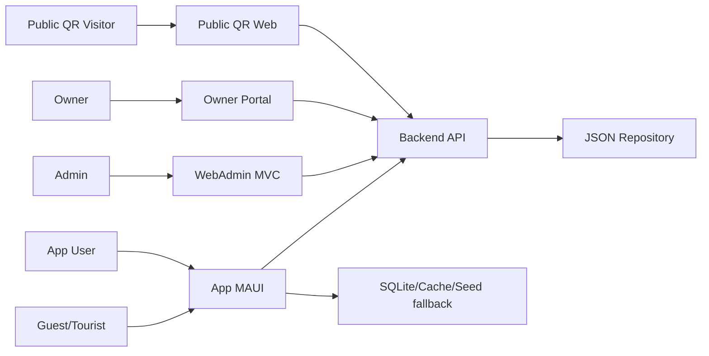

## 3.5. Đặc tả Use Case chi tiết

**Bảng 3. UC-01 - Đăng nhập WebAdmin**

| Trường | Nội dung |
| --- | --- |
| Mã use case | UC-01 |
| Tên use case | Đăng nhập WebAdmin |
| Actor chính | Admin/Owner |
| Actor phụ | WebAdminAuthService |
| Tiền điều kiện | Tài khoản tồn tại trong `web-admin-users.json`. |
| Luồng chính | Mở `/Account/Login`, nhập username/password, AccountController gọi ValidateCredentials, tạo cookie claims, redirect Admin về Dashboard hoặc Owner về Owner Portal. |
| Luồng thay thế/ngoại lệ | Sai mật khẩu trả lại login; thiếu quyền vào AdminOnly hiển thị AccessDenied; logout xóa cookie. |
| Hậu điều kiện | Có session WebAdmin hợp lệ. |
| Controller/ViewModel/Service/API/File liên quan | AccountController, WebAdminSecurity.cs, WebAdminAccountStore.cs |

**Bảng 4. UC-02 - Admin tạo/sửa/xóa POI**

| Trường | Nội dung |
| --- | --- |
| Mã use case | UC-02 |
| Tên use case | Admin tạo/sửa/xóa POI |
| Actor chính | Admin |
| Actor phụ | Backend API |
| Tiền điều kiện | Đã đăng nhập role Admin. |
| Luồng chính | Admin mở `/Pois`, nhập form, PoiAdminService validate và gọi PoiApiClient; API `PoisController` lưu vào `pois.json` và ghi audit. |
| Luồng thay thế/ngoại lệ | Trùng code, thiếu tên hoặc tọa độ sai trả validation/conflict; delete là soft delete. |
| Hậu điều kiện | POI được cập nhật để app/Web đọc lại. |
| Controller/ViewModel/Service/API/File liên quan | CTest.WebAdmin/Controllers/PoisController.cs, VKFoodAPI/Controllers/PoisController.cs, PoiRepository.cs |

**Bảng 5. UC-03 - Owner đăng ký POI mới**

| Trường | Nội dung |
| --- | --- |
| Mã use case | UC-03 |
| Tên use case | Owner đăng ký POI mới |
| Actor chính | Owner |
| Actor phụ | PoiAdminService |
| Tiền điều kiện | Owner đã đăng nhập role PoiOwner. |
| Luồng chính | Owner mở `/Owner`, điền form; OwnerController ép owner metadata và `IsActive=false`; service tạo POI qua API. |
| Luồng thay thế/ngoại lệ | Dữ liệu không hợp lệ trả form lỗi; API offline hiển thị thông báo. |
| Hậu điều kiện | POI mới ở trạng thái chờ duyệt. |
| Controller/ViewModel/Service/API/File liên quan | OwnerController.cs, PoiValidationService.cs, PoiAdminService.cs |

**Bảng 6. UC-04 - Admin duyệt POI Owner gửi**

| Trường | Nội dung |
| --- | --- |
| Mã use case | UC-04 |
| Tên use case | Admin duyệt POI Owner gửi |
| Actor chính | Admin |
| Actor phụ | Owner |
| Tiền điều kiện | Có POI pending `IsActive=false`. |
| Luồng chính | Admin mở danh sách POI pending, kiểm tra thông tin và bấm duyệt; PoiAdminService bật active và gọi API update. |
| Luồng thay thế/ngoại lệ | Không tìm thấy POI hoặc API lỗi thì hiển thị TempData message. |
| Hậu điều kiện | POI active xuất hiện cho app/public API. |
| Controller/ViewModel/Service/API/File liên quan | PoisController.Approve, PoiAdminService.ApproveAsync |

**Bảng 7. UC-05 - Admin tạo/sửa Tour**

| Trường | Nội dung |
| --- | --- |
| Mã use case | UC-05 |
| Tên use case | Admin tạo/sửa Tour |
| Actor chính | Admin |
| Actor phụ | POI Repository |
| Tiền điều kiện | Có ít nhất một POI active. |
| Luồng chính | Admin mở `/Tours`, chọn POI theo thứ tự, nhập mã/tên/thời lượng; TourAdminService gọi `api/tours`. |
| Luồng thay thế/ngoại lệ | Không có POI, POI trùng hoặc POI không còn tồn tại thì validation lỗi. |
| Hậu điều kiện | Tour lưu trong `tours.json` với `PoiIds` có thứ tự. |
| Controller/ViewModel/Service/API/File liên quan | ToursController.cs, TourAdminService.cs, VKFoodAPI/Services/TourRepository.cs |

**Bảng 8. UC-06 - App chọn tour và đi theo tour**

| Trường | Nội dung |
| --- | --- |
| Mã use case | UC-06 |
| Tên use case | App chọn tour và đi theo tour |
| Actor chính | Guest/App User |
| Actor phụ | TourProvider |
| Tiền điều kiện | App đã tải tour active. |
| Luồng chính | Người dùng chọn tour; `MainViewModel.ActivateTourAsync` đặt `_activeTourId`, phát giới thiệu tour, map chỉ hiển thị POI trong tour. |
| Luồng thay thế/ngoại lệ | Tour không còn active hoặc không có stop hợp lệ thì báo trạng thái. |
| Hậu điều kiện | App theo dõi current/next stop và tiến độ tour. |
| Controller/ViewModel/Service/API/File liên quan | MainViewModel.cs, TourProvider.cs, TourRepository.cs |

**Bảng 9. UC-07 - App tự động thuyết minh GPS/geofence**

| Trường | Nội dung |
| --- | --- |
| Mã use case | UC-07 |
| Tên use case | App tự động thuyết minh GPS/geofence |
| Actor chính | Guest/App User |
| Actor phụ | LocationService |
| Tiền điều kiện | Có quyền vị trí hoặc app nhận được location hợp lệ. |
| Luồng chính | `OnLocationUpdated` gọi `ApplyLocationSnapshotAsync`; GeofenceEngine đánh giá bán kính; decision service xét priority, debounce, cooldown; NarrationService phát. |
| Luồng thay thế/ngoại lệ | Không có quyền vị trí thì fallback map đầu phố; đang phát thì không phát chồng; cooldown thì bỏ qua. |
| Hậu điều kiện | Người dùng nghe đúng POI và history được ghi. |
| Controller/ViewModel/Service/API/File liên quan | LocationService.cs, GeofenceEngine.cs, PoiAutoNarrationDecisionService.cs, NarrationService.cs |

**Bảng 10. UC-08 - App/Web quét QR**

| Trường | Nội dung |
| --- | --- |
| Mã use case | UC-08 |
| Tên use case | App/Web quét QR |
| Actor chính | Guest/Public QR Visitor |
| Actor phụ | ResolveQrController |
| Tiền điều kiện | QR chứa POI/Tour code, path hoặc deep link hợp lệ. |
| Luồng chính | Web mở `/qr/{targetType}/{targetId}`, render POI/Tour rồi chạy `DeviceCapabilitySimulation`; app scan camera/manual gọi `GET /api/resolve-qr?code=...` để resolve POI/Tour. |
| Luồng thay thế/ngoại lệ | QR không hợp lệ trả 404/thông báo; camera denied cho phép nhập mã thủ công; public web offline thì hiển thị thông báo và dùng cache/text hiện có. |
| Hậu điều kiện | Mở đúng POI/Tour, hiển thị profile mạnh/yếu và có thể autoplay. |
| Controller/ViewModel/Service/API/File liên quan | QrCodesController.cs, Scan.cshtml, qr-device-profile.js, ResolveQrController.cs, QrScannerPage.xaml.cs, QrDeepLinkBroker.cs |

**Bảng 11. UC-09 - Ghi listening history**

| Trường | Nội dung |
| --- | --- |
| Mã use case | UC-09 |
| Tên use case | Ghi listening history |
| Actor chính | App/Web QR |
| Actor phụ | ListeningHistoryRepository |
| Tiền điều kiện | Người dùng bắt đầu nghe POI. |
| Luồng chính | App tạo optimistic item, `BeginAsync` POST history; phát xong gọi `CompleteAsync`; web QR dùng proxy `/qr/analytics/listening-history`. |
| Luồng thay thế/ngoại lệ | API lỗi thì app giữ local/optimistic; playback lỗi cập nhật ErrorMessage nếu có history id. |
| Hậu điều kiện | History có thời điểm bắt đầu, số giây nghe, completed/error. |
| Controller/ViewModel/Service/API/File liên quan | ListeningHistorySyncService.cs, ListeningHistoryController.cs, ListeningHistoryRepository.cs |

**Bảng 12. UC-10 - Dashboard analytics**

| Trường | Nội dung |
| --- | --- |
| Mã use case | UC-10 |
| Tên use case | Dashboard analytics |
| Actor chính | Admin |
| Actor phụ | API telemetry |
| Tiền điều kiện | Admin đăng nhập và API truy cập được. |
| Luồng chính | DashboardService gọi POI, Tour, Audio, ListeningHistory, ActiveDevices; tính tổng, top POI, completion, QR listen rate, SSE active devices. |
| Luồng thay thế/ngoại lệ | API lỗi trả dashboard rỗng `IsSyncOnline=false` để tránh số liệu giả. |
| Hậu điều kiện | Admin xem được tình trạng sử dụng hệ thống. |
| Controller/ViewModel/Service/API/File liên quan | HomeController.cs, DashboardService.cs, ActiveDevicesController.cs |

# CHƯƠNG 4. THIẾT KẾ HỆ THỐNG

## 4.1. Kiến trúc tổng thể

Hệ thống được thiết kế thành ba khối chính: App MAUI Android, WebAdmin MVC và Backend API. `VinhKhanhGuide.Core` đóng vai trò lớp hợp đồng dùng chung, chứa DTO/model/service contract để giảm lệch dữ liệu giữa các project.

**Hình 2. Kiến trúc tổng thể App/WebAdmin/API/JSON Repository**

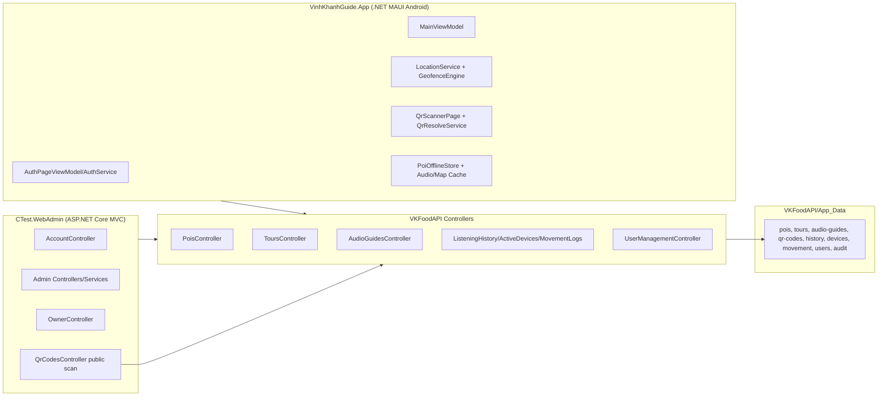

## 4.2. Thiết kế phân quyền

**Bảng 13. Thiết kế phân quyền**

| Vai trò/cơ chế | Cách triển khai | Quyền chính |
| --- | --- | --- |
| Admin | Cookie auth + role `Admin`; policy `WebAdminPolicies.AdminOnly`. | Quản trị toàn bộ WebAdmin, POI, Tour, Audio, Translation, QR, users, dashboard. |
| Owner/PoiOwner | Cookie auth + role `PoiOwner`; policy `OwnerArea`; claims owner code/email. | Vào Owner Portal, xem POI khớp owner, đăng ký POI mới. |
| Guest | App tạo guest session local với user code `guest-...`. | Xem/nghe/quét QR, ghi history theo guest scope. |
| App User | AuthService local Preferences, sync profile public API. | Lưu hồ sơ, lịch sử nghe theo user code/email. |
| Public QR Visitor | `[AllowAnonymous]` ở public QR scan và proxy analytics. | Mở QR web, nghe nội dung, ghi analytics web. |
| API Admin Key | `AdminApiKeyAuthenticationHandler`, header `X-Admin-Api-Key`. | CRUD API quản trị, raw active devices, audit, app user management. |

## 4.3. Thiết kế dữ liệu

Vì source code lưu dữ liệu bằng JSON repository, ERD dưới đây là mô hình logic để diễn giải quan hệ nghiệp vụ, không phải mô tả database quan hệ đang chạy. `TOUR_POI_LINK` là bảng logic biểu diễn danh sách có thứ tự `TourDto.PoiIds`. Các field dạng list/dictionary như `NarrationTranslations`, `FeaturedCategories` và `PoiIds` được lưu trực tiếp trong JSON DTO.

**Hình 3. ERD logic của hệ thống**

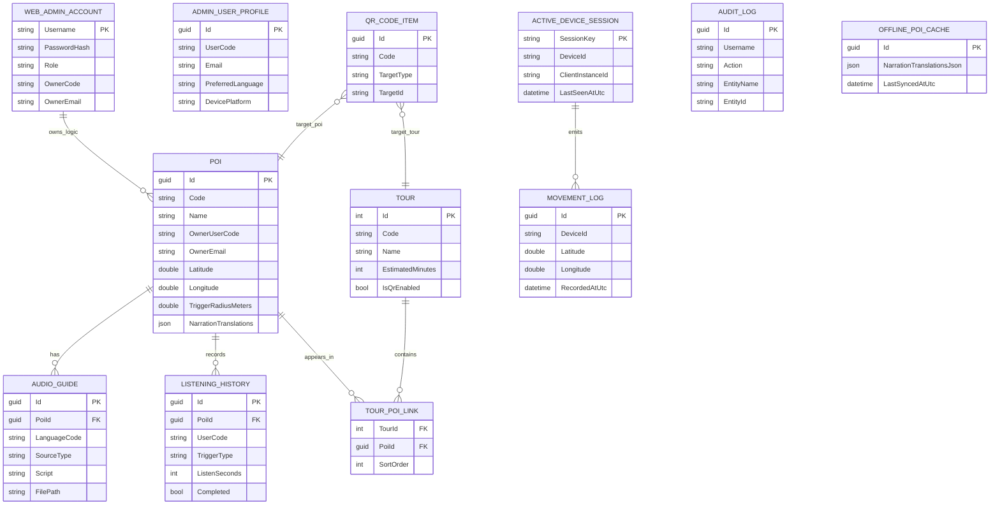

## 4.4. Thiết kế API

**Bảng 14. API Matrix rút gọn theo route thật**

| Nhóm | Endpoint | Method | Quyền | Controller | Repository/service | Mục đích |
| --- | --- | --- | --- | --- | --- | --- |
| POI public | `/api/pois`, `/api/pois/{id}`, `/api/pois/by-qr?code=` | GET | Public | VKFoodAPI.Controllers.PoisController | PoiRepository | Đọc POI active/non-deleted cho app/web. |
| POI admin | `/api/pois`, `/api/pois/{id}` | POST/PUT/DELETE | X-Admin-Api-Key | PoisController | PoiRepository + AuditLogRepository | Tạo, sửa, soft delete POI và ghi audit. |
| Tour public | `/api/tours`, `/api/tours/{id}` | GET | Public | ToursController | TourRepository | Đọc tour active cho app và QR. |
| Tour admin | `/api/tours`, `/api/tours/{id}` | POST/PUT/DELETE | X-Admin-Api-Key | ToursController | TourRepository + AuditLogRepository | CRUD tour; delete là soft delete và tắt QR. |
| Audio guide | `/api/audioguides`, `/api/audioguides/{id}` | GET/POST/PUT/DELETE | X-Admin-Api-Key | AudioGuidesController | AudioGuideRepository | Quản lý TTS/file audio. Route thật là `api/[controller]` nên client dùng `api/audioguides`. |
| QR item API | `/api/qr-codes`, `/api/qr-codes/{id}` | GET/POST/PUT/DELETE | X-Admin-Api-Key | QrCodesController | QrCodeRepository | CRUD QR item ở API; UI WebAdmin QR độc lập chưa có. |
| QR resolve | `/api/resolve-qr?code=...` | GET | Public | ResolveQrController | QrCodeRepository + PoiRepository + TourRepository | Resolve deep link/path/code sang POI/Tour. |
| Listening history | `/api/analytics/listening-history`, alias `/api/narration-histories` | GET/POST/PUT/DELETE | Public query scoped | ListeningHistoryController | ListeningHistoryRepository | Ghi begin/complete, ranking, xóa history. |
| Active devices | `/api/analytics/active-devices`, alias `/api/device-presence` | GET/POST | Stats/heartbeat public; raw admin | ActiveDevicesController | ActiveDeviceRepository + MovementLogRepository | Heartbeat/disconnect, active stats, ghi movement log từ tọa độ hợp lệ. |
| Movement logs | `/api/movement-logs` | GET/POST | Public trong code hiện tại | MovementLogsController | MovementLogRepository | Lưu và truy vấn log di chuyển theo device/user/time. |
| App user public sync | `/api/users/profile-sync`, `/api/app-users/sync` | POST | AllowAnonymous | UserManagementController | UserManagementRepository | App đồng bộ hồ sơ người dùng/guest. |
| Admin user profile | `/api/admin/users`, `/api/admin/users/search`, `/api/admin/users/{id}` | GET/POST | X-Admin-Api-Key | UserManagementController | UserManagementRepository | WebAdmin quản lý/xem app user profile. |
| Audit logs | `/api/audit-logs` | GET/POST | X-Admin-Api-Key | AuditLogsController | AuditLogRepository | Lưu/truy vấn audit log. |

## 4.5. Thiết kế App MAUI

`MainViewModel` là trung tâm điều phối app: load POI/tour, trạng thái map, GPS, geofence, tour, narration, history, offline package và audio settings. Các service được inject trong `MauiProgram.cs`.

**Bảng 15. Thành phần thiết kế App MAUI**

| Thành phần | Vai trò |
| --- | --- |
| MainViewModel | Điều phối UI, tour, POI, narration, history và map state. |
| LocationService | Xin quyền và lấy/cập nhật vị trí thiết bị. |
| GeofenceEngine | Tính khoảng cách và xác định POI nằm trong bán kính kích hoạt. |
| PoiAutoNarrationDecisionService | Chọn candidate theo priority, distance, debounce, cooldown và trạng thái đang phát. |
| NarrationService | Phát TTS hoặc file audio; chính sách cancel/replace playback. |
| QrScannerPage/QrResolveService/QrDeepLinkBroker | Quét/resolve QR và mở POI/Tour/deep link. |
| PoiOfflineStore | SQLite `poi_cache` và `sync_metadata` cho offline snapshot. |
| AudioAssetCacheService | Cache file audio remote/package/local vào app data. |
| ActiveDeviceTracker | Heartbeat 8 giây, gửi device/session/location nếu có. |

## 4.6. Thiết kế WebAdmin

**Bảng 16. Thành phần thiết kế WebAdmin**

| Controller/Service | Chức năng |
| --- | --- |
| AccountController | Login/logout cookie, redirect theo role. |
| HomeController + DashboardService | Dashboard, active device JSON/SSE, usage snapshot. |
| PoisController + PoiAdminService | Quản lý POI, create/edit/approve/delete. |
| ToursController + TourAdminService | Quản lý tour và danh sách POI trong tour. |
| AudioGuidesController + AudioGuideAdminService | Quản lý audio/TTS cho POI. |
| QrCodesController + qr-device-profile.js | Tạo/in/tải QR public động cho POI/Tour, public scan và mô phỏng cấu hình thiết bị mạnh/yếu cho offline/minimal mode. |
| OwnerController | Owner portal, POI owner, history liên quan, đăng ký POI mới. |
| AdminUsersController | Quản lý tài khoản WebAdmin lưu `web-admin-users.json`. |
| SystemAdminController | Quản lý app user/profile qua UserManagementApiClient. |
| MapPoisController | Quản lý POI trên bản đồ và analytics map. |
| UsageLogsController | Xem listening history/usage logs. |
| TranslationsController + TtsTranslationService | Quản lý script ngôn ngữ `vi/en/zh/ja/de`. |

## 4.7. Thiết kế Sequence Diagram

**Hình 4. WEB-01. Đăng nhập, phân quyền và đăng xuất**

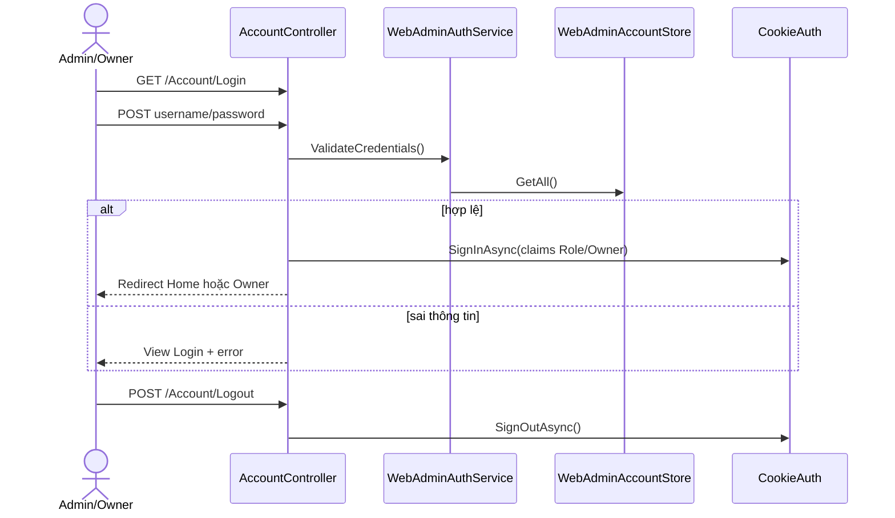

**Hình 5. WEB-02. Dashboard tổng quan và realtime active devices**

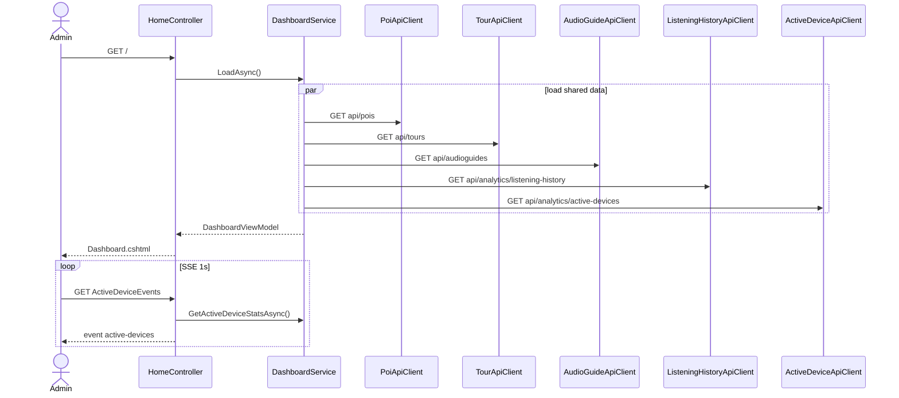

**Hình 6. WEB-03. Admin quản lý POI**

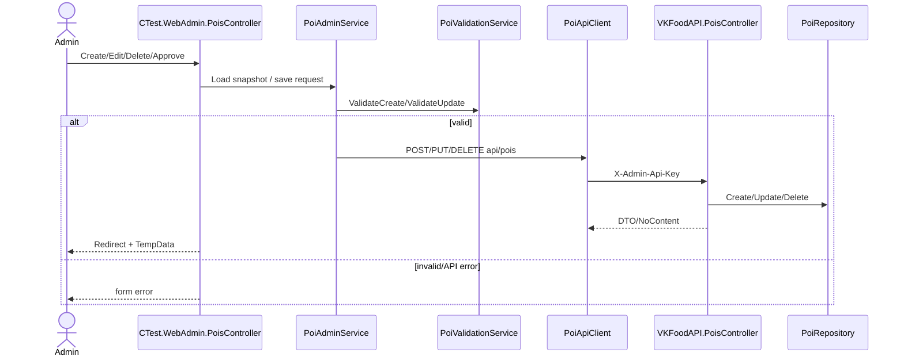

**Hình 7. WEB-04. Quản lý Audio Guide/TTS**

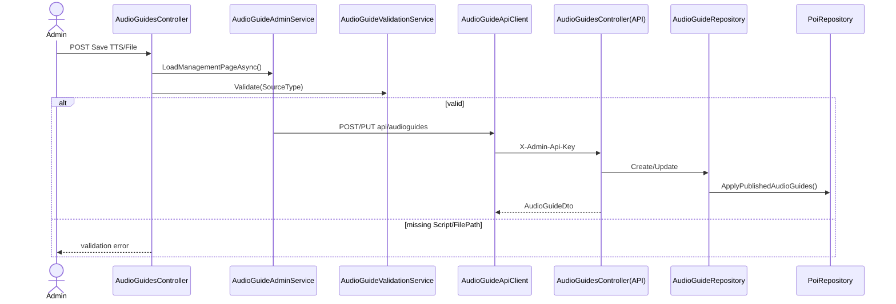

**Hình 8. WEB-05. Quản lý Tour**

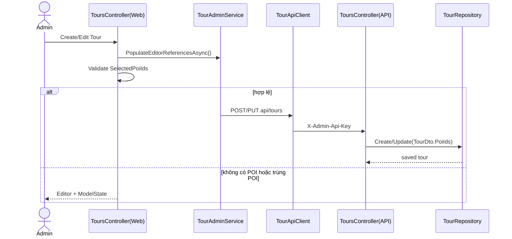

**Hình 9. WEB-06. Quản lý QR public cho POI/Tour**

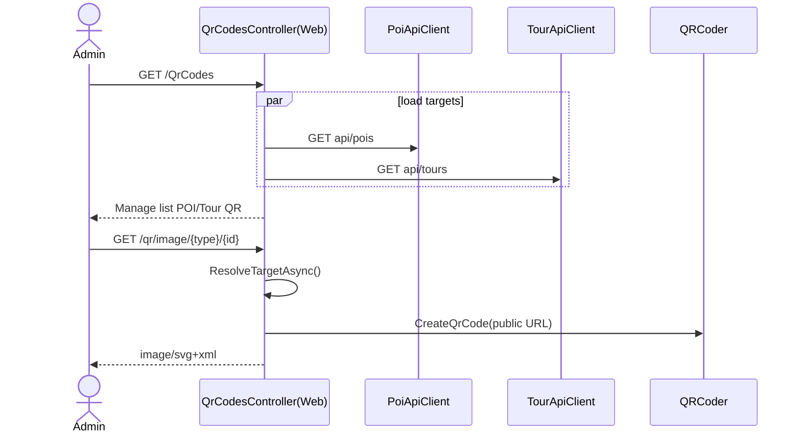

**Hình 10. WEB-07. Public QR scan, mô phỏng device profile và ghi analytics**

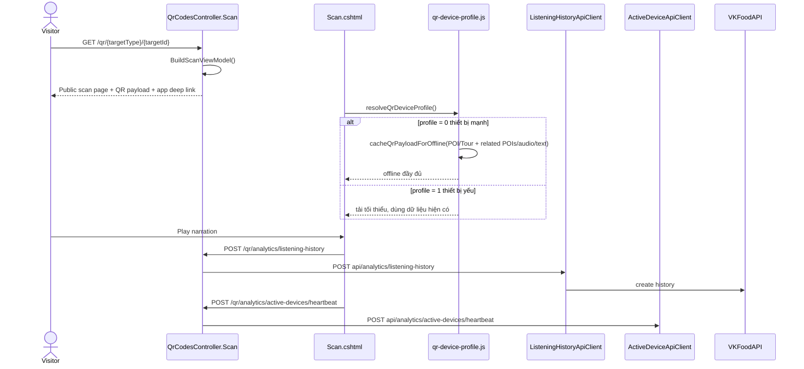

**Hình 11. WEB-08. Map Analytics**

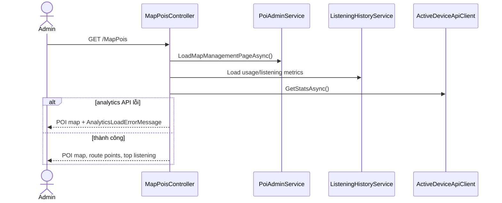

**Hình 12. WEB-09. Owner Portal đăng ký POI**

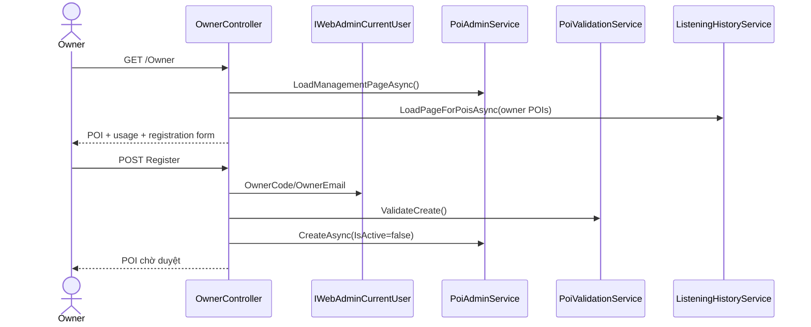

**Hình 13. WEB-10A. AdminUsersController quản lý tài khoản WebAdmin**

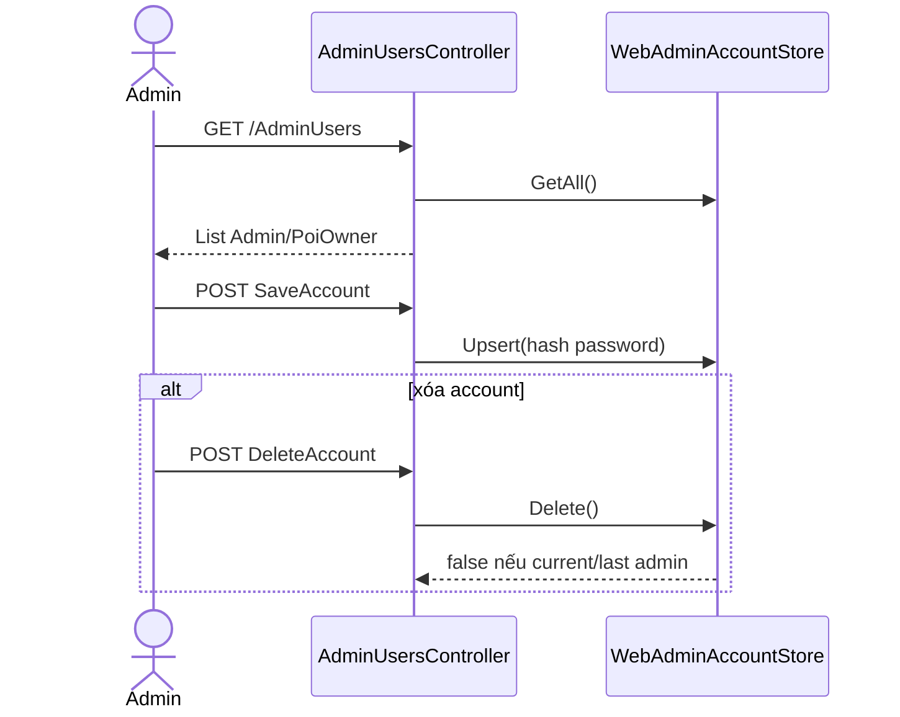

**Hình 14. WEB-10B. SystemAdminController quản lý App User/Profile**

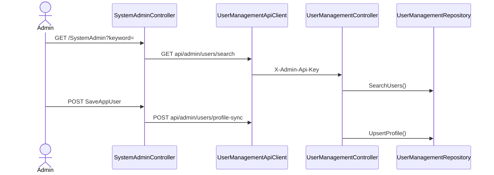

**Hình 15. WEB-11. Translation scripts**

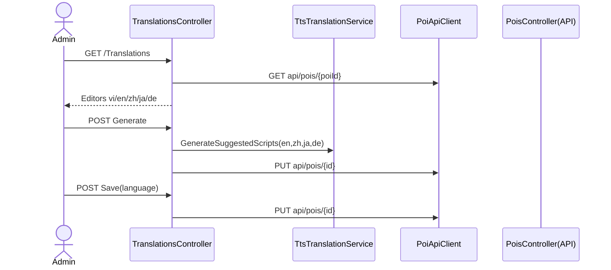

**Hình 16. APP-01. Mở app, chọn ngôn ngữ và Guest Mode**

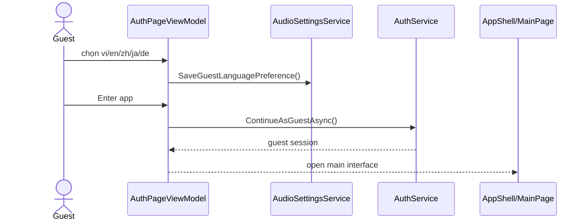

**Hình 17. APP-02. Load POI/Tour từ API, fallback offline/cache/seed**

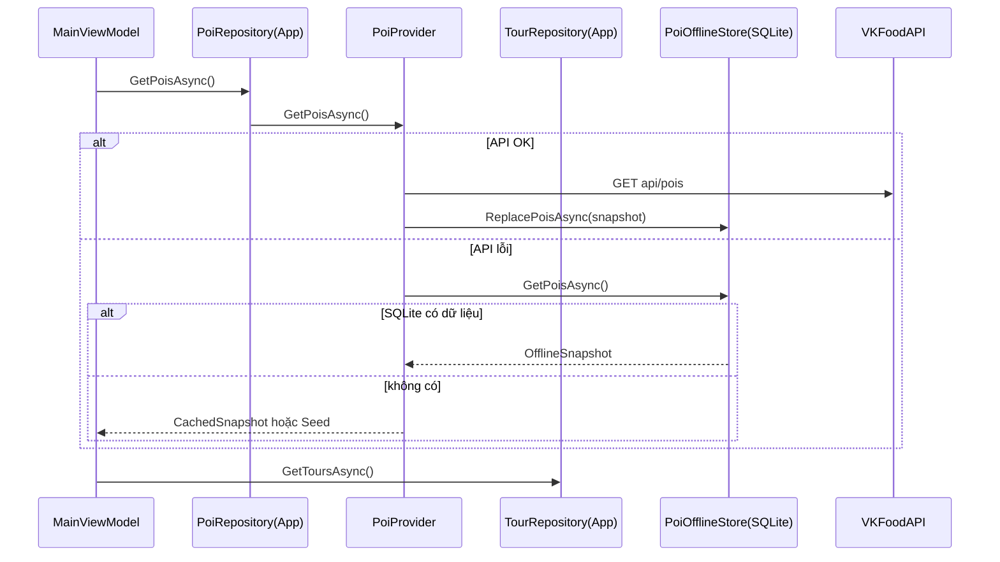

**Hình 18. APP-03. GPS/geofence auto narration**

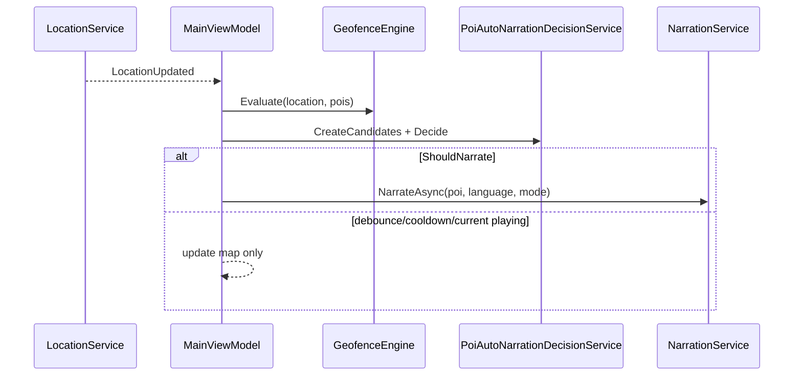

**Hình 19. APP-04. Nghe POI thủ công**

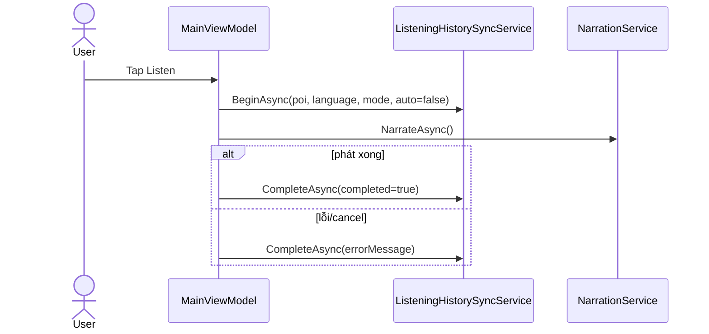

**Hình 20. APP-05. Chọn tour và bản đồ chỉ hiện POI thuộc tour**

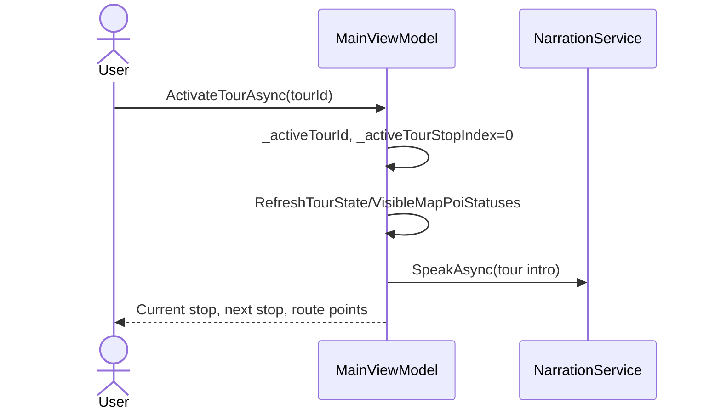

**Hình 21. APP-06. Quét QR mở POI/Tour**

```mermaid
sequenceDiagram
    actor User
    participant Page as QrScannerPage
    participant Resolve as QrResolveService
    participant API as ResolveQrController
    participant VM as MainViewModel
    User->>Page: Scan camera hoặc nhập mã
    Page->>Resolve: ResolveAsync(code)
    Resolve->>API: GET api/resolve-qr?code=
    alt TargetType=tour
        Page->>VM: OpenTourFromQrAsync(tourId)
    else TargetType=poi
        Page->>VM: OpenPoiFromQrAsync(poiId)
    end
```

**Hình 22. APP-07. Listening history begin/complete/delete**

```mermaid
sequenceDiagram
    participant VM as MainViewModel
    participant H as ListeningHistorySyncService
    participant API as ListeningHistoryController
    VM->>H: BeginAsync()
    H->>API: POST api/analytics/listening-history
    API-->>H: historyId
    VM->>H: CompleteAsync(historyId)
    H->>API: PUT api/analytics/listening-history/{id}
    VM->>H: GetCurrentUserHistoryAsync()
    H->>API: GET history + ranking
    VM->>H: DeleteAsync/DeleteCurrentUserHistoryAsync()
```

**Hình 23. APP-08. Active device heartbeat và movement log**

```mermaid
sequenceDiagram
    participant App as MainViewModel/App
    participant Tracker as ActiveDeviceTracker
    participant Loc as LocationService
    participant API as ActiveDevicesController
    participant Move as MovementLogRepository
    App->>Tracker: StartAsync()
    loop mỗi 8 giây
        Tracker->>Loc: Get cached/current location nếu được
        Tracker->>API: POST api/analytics/active-devices/heartbeat
        API->>Move: Create movement log nếu tọa độ hợp lệ
    end
    App->>Tracker: StopAsync()
    Tracker->>API: POST disconnect
```

**Hình 24. APP-09. Offline cache/audio cache**

```mermaid
sequenceDiagram
    actor User
    participant VM as MainViewModel
    participant Store as PoiOfflineStore
    participant Map as MapOfflineTileService
    participant Audio as AudioAssetCacheService
    User->>VM: DownloadOfflinePackageAsync
    VM->>Store: ReplacePoisAsync()
    VM->>Map: PrefetchAsync()
    VM->>Audio: PrefetchAsync(pois)
    alt API mất kết nối
        VM->>Store: GetPoisAsync()
        VM-->>User: OfflineSnapshotNotice
    end
```

**Hình 25. APP-10. Auth/Profile sync**

```mermaid
sequenceDiagram
    actor User
    participant Auth as AuthService
    participant VM as MainViewModel
    participant Sync as UserProfileSyncService
    participant API as UserManagementController
    User->>Auth: Register/SignIn/Guest
    Auth-->>VM: SessionChanged
    VM->>Sync: SyncCurrentUserAsync(preferredLanguage)
    Sync->>API: POST /api/users/profile-sync hoặc /api/app-users/sync
    API-->>Sync: AdminUserDetailDto
```

# CHƯƠNG 5. TRIỂN KHAI HỆ THỐNG

## 5.1. Cấu trúc source code

**Bảng 17. Cấu trúc source code**

| Project | Vai trò | Thành phần chính | Ghi chú |
| --- | --- | --- | --- |
| VKFoodAPI | Backend API | Controllers, Services/Repositories, Security, App_Data | ASP.NET Core Web API, JSON repository. |
| CTest.WebAdmin | WebAdmin MVC | Controllers, Services, Views, Security, App_Data/web-admin-users.json | Cookie auth, typed API clients, QRCoder. |
| VinhKhanhGuide.App | Mobile app | ViewModels, Services, Views, Resources, Platforms/Android | .NET MAUI Android, Mapsui, ZXing, TTS. |
| VinhKhanhGuide.Core | DTO/model/shared logic | Contracts, Models, Interfaces, Mappings, Seed, Services | Dùng chung cho App, WebAdmin, API. |
| VinhKhanhGuide.Core.Tests | Kiểm thử unit/integration nhẹ | PoiAutoNarrationDecisionServiceTests, ApiRepositoryFlowTests | Đối chiếu core logic và repository flow. |

## 5.2. Triển khai Backend API

Trong source code, backend được triển khai chủ yếu tại `VKFoodAPI/Controllers` và `VKFoodAPI/Services`. Mỗi nhóm dữ liệu có repository JSON riêng, ví dụ `PoiRepository`, `TourRepository`, `AudioGuideRepository`, `ListeningHistoryRepository`, `ActiveDeviceRepository`, `MovementLogRepository`, `UserManagementRepository` và `AuditLogRepository`.

- Public endpoint đọc dữ liệu: `GET /api/pois`, `GET /api/tours`, `GET /api/resolve-qr?code=...`.
- Admin endpoint dùng `AdminApiKeyDefaults.PolicyName` và header `X-Admin-Api-Key`.
- Audit log được ghi khi tạo/sửa/xóa POI, Tour và QR item.
- Hosted service `ActiveDevicePruningService` dọn active device quá hạn; `DataRepairWarmupService` khởi động/sửa dữ liệu cần thiết.
- Listening history và active devices là telemetry phục vụ dashboard, usage logs và map analytics.

## 5.3. Triển khai WebAdmin

WebAdmin dùng Cookie Authentication trong `Program.cs`, tài khoản lưu tại `CTest.WebAdmin/App_Data/web-admin-users.json`. Controller WebAdmin không ghi trực tiếp POI/tour/audio vào file mà đi qua typed API clients, nhờ đó WebAdmin và app dùng chung API contract.

- Dashboard: `HomeController` + `DashboardService` gọi song song các API client và có SSE `ActiveDeviceEvents`.
- POI: `PoisController`, `PoiAdminService`, `PoiValidationService`, `PoiImageStorageService`.
- Tour: `ToursController`, `TourAdminService`, validate selected POI và thứ tự stop.
- Audio/TTS: `AudioGuidesController`, `AudioGuideAdminService`, `AudioGuideValidationService`.
- QR: `QrCodesController` tạo QR public động cho POI/Tour, không phải CRUD UI độc lập cho `qr-codes.json`; public QR nhúng `qr-device-profile.js` để mô phỏng `0 = mạnh`, `1 = yếu`.
- Owner Portal: `OwnerController` lọc owner metadata và tạo POI pending.
- User/Admin management: `AdminUsersController` quản lý WebAdmin account; `SystemAdminController` quản lý app user/profile qua API.

## 5.4. Triển khai App MAUI

Trong app, `MainViewModel` điều phối hầu hết workflow. Khi khởi tạo, app tải POI/tour từ API, cập nhật danh sách bản đồ, phục hồi offline status và xử lý quyền vị trí. Khi vị trí thay đổi, app đánh giá geofence rồi quyết định có phát thuyết minh hay không.

- Auth/guest mode: `AuthPageViewModel` và `AuthService` tạo session guest hoặc local user.
- Map/GPS/geofence: `LocationService`, `GeofenceEngine`, `PoiAutoNarrationDecisionService`.
- TTS/audio: `NarrationService` chọn TextToSpeech hoặc Android MediaPlayer theo playback mode.
- QR: `QrScannerPage`, `QrResolveService`, `QrDeepLinkBroker`.
- Tour: `TourProvider`, `TourRepository`, `MainViewModel.ActivateTourAsync` và các method active tour.
- Offline/history/heartbeat: `PoiOfflineStore`, `AudioAssetCacheService`, `ListeningHistorySyncService`, `ActiveDeviceTracker`.

## 5.5. Một số đoạn xử lý tiêu biểu

**Bảng 18. Các luồng xử lý tiêu biểu**

| Luồng | Class/method liên quan | Cách xử lý | Lý do thiết kế |
| --- | --- | --- | --- |
| Lấy danh sách POI | App gọi `MainViewModel.RefreshPoisIfChangedAsync`, sau đó `PoiRepository.GetPoisAsync` và `PoiProvider.GetPoisAsync`. | API thành công thì map DTO sang domain, cache vào SQLite; API lỗi thì đọc SQLite, cached snapshot hoặc seed. | Thiết kế này giúp app vẫn dùng được khi mất mạng hoặc backend tạm dừng. |
| Auto narration | `ApplyLocationSnapshotAsync` nhận location, `GeofenceEngine.Evaluate` tính khoảng cách, `PoiAutoNarrationDecisionService.Decide` chọn POI. | Nếu `ShouldNarrate=true`, `NarratePoiAsync` gọi `NarrationService` và đồng bộ history. | Tách decision service giúp logic priority/cooldown/debounce có thể test độc lập. |
| Chọn tour | `ActivateTourAsync` đặt `_activeTourId`, `_activeTourStopIndex=0`, refresh tour state và phát tour intro. | Map chỉ hiện POI thuộc `TourDto.PoiIds`; khi phát xong stop hợp lệ, `TryAdvanceActiveTourAfterNarration` chuyển chặng. | Thiết kế lưu `PoiIds` có thứ tự đủ đơn giản cho JSON repository. |
| QR resolve/deep link | `QrScannerPage` dùng ZXing hoặc input thủ công, gọi `QrResolveService.ResolveAsync` tới `/api/resolve-qr?code=...`. | Resolve API hỗ trợ deep link, path `/qr/{type}/{id}`, QR item code, POI code và tour code. | Một endpoint resolve chung giảm logic lặp giữa app và web public. |
| Mô phỏng cấu hình QR Web | `Scan.cshtml` truyền QR payload sang `qr-device-profile.js`, sau đó gọi `resolveQrDeviceProfile()`. | Code dùng `const profile = Math.random() < 0.5 ? 0 : 1;` và kiểm tra `if (profile === 0)`. Profile `0` là thiết bị mạnh: cache payload POI/Tour, POI liên quan và asset audio nếu có. Profile `1` là thiết bị yếu: không prefetch toàn bộ, chỉ dùng dữ liệu đang mở và fallback text/TTS. | Đáp ứng yêu cầu demo của giảng viên nhưng ghi rõ đây là mô phỏng, chưa phải đo cấu hình thật. |
| Ghi listening history | `NarratePoiAsync` tạo optimistic history, gọi `BeginAsync`; sau khi phát, gọi `CompleteAsync` với listen seconds và trạng thái completed/error. | Web QR ghi history qua proxy MVC `/qr/analytics/listening-history`. | History snapshot lưu cả thông tin POI để dashboard không phụ thuộc hoàn toàn vào POI hiện tại. |
| Dashboard active devices | `ActiveDeviceTracker` gửi heartbeat 8 giây; API cập nhật session và ghi movement log nếu tọa độ hợp lệ. | `DashboardService.GetActiveDeviceStatsAsync` lấy stats; `HomeController.ActiveDeviceEvents` đẩy SSE khi payload thay đổi. | Thiết kế này phù hợp demo realtime nhẹ mà không cần SignalR. |
| Owner đăng ký POI | `OwnerController.Register` ép `IsActive=false`, owner code/email từ claims rồi gọi `PoiAdminService.CreateAsync`. | Admin sau đó duyệt bằng `PoisController.Approve`. | Luồng này giữ quyền publish POI ở Admin, hạn chế owner tự đưa nội dung lên app. |

# CHƯƠNG 6. KIỂM THỬ VÀ ĐÁNH GIÁ

## 6.1. Môi trường kiểm thử

- Hệ điều hành phát triển: macOS/Windows tùy máy sinh viên; source hiện ở workspace `/Users/nhatminh/Documents/C-test-`.
- SDK/framework: .NET 8, ASP.NET Core Web API/MVC, .NET MAUI Android.
- Thiết bị kiểm thử app: Android Emulator hoặc thiết bị Android thật; app target `net8.0-android`.
- API/WebAdmin chạy local qua `CTest.WebAdmin` hoặc chạy riêng `VKFoodAPI` + `CTest.WebAdmin`.
- Dữ liệu mẫu: JSON trong `VKFoodAPI/App_Data` với POI, tour, audio, QR, history, active devices, movement logs và user profiles.

## 6.2. Test case chức năng

**Bảng 19. Test case chức năng**

| Mã test | Chức năng | Bước kiểm thử | Dữ liệu đầu vào | Kết quả mong đợi | Kết quả thực tế | Trạng thái |
| --- | --- | --- | --- | --- | --- | --- |
| TC-01 | Login Admin | Mở `/Account/Login`, nhập `user/12345678`. | user/12345678 | Vào Dashboard. | Đạt theo cấu hình demo. | Pass |
| TC-02 | Login Owner | Đăng nhập `owner/12345678`. | owner/12345678 | Vào Owner Portal, không vào AdminOnly. | Đạt theo role PoiOwner. | Pass |
| TC-03 | Admin tạo POI | Mở `/Pois/Create`, nhập thông tin hợp lệ. | Code mới, tọa độ hợp lệ. | POI lưu vào API/JSON. | Đạt theo PoiRepository.Create. | Pass |
| TC-04 | Admin sửa POI | Mở edit POI, đổi tên/bán kính. | POI id có sẵn. | API update và UpdatedAtUtc đổi. | Đạt theo PoiRepository.Update. | Pass |
| TC-05 | Admin xóa POI | Bấm Delete POI. | POI id có sẵn. | Soft delete, IsActive=false, IsDeleted=true. | Đạt theo PoiRepository.Delete. | Pass |
| TC-06 | Owner đăng ký POI | Owner điền form Register. | Tên, code, tọa độ, owner metadata. | POI tạo `IsActive=false`. | Đạt theo OwnerController.Register. | Pass |
| TC-07 | Admin duyệt POI | Admin lọc pending và approve. | POI pending. | POI active xuất hiện cho app. | Đạt theo PoiAdminService.ApproveAsync. | Pass |
| TC-08 | Tạo tour | Admin tạo tour với >=1 POI. | Tên, code, EstimatedMinutes, POI ids. | Tour lưu `tours.json`. | Đạt theo ToursController/TourRepository. | Pass |
| TC-09 | App load POI | Mở app, InitializeAsync. | API online. | Tải 11 POI active. | Đạt theo dữ liệu hiện tại. | Pass |
| TC-10 | App chọn tour | Chọn tour trong app. | Tour active id 1/2. | Bản đồ chỉ hiện stop trong tour và phát intro. | Đạt theo MainViewModel.ActivateTourAsync. | Pass |
| TC-11 | Auto geofence | Giả lập vị trí trong bán kính POI. | Location gần POI. | Tự phát nếu không cooldown/debounce. | Đạt theo decision service. | Pass |
| TC-12 | Nghe thủ công | Bấm nghe ở POI detail. | Selected POI. | Phát TTS/audio và ghi history. | Đạt theo NarratePoiAsync. | Pass |
| TC-13 | App quét QR | Scan hoặc nhập mã QR/URL. | POI/Tour code hợp lệ. | Mở POI/Tour tương ứng. | Đạt theo QrResolveService. | Pass |
| TC-14 | Public QR web nghe nội dung | Mở `/qr/poi/{id}` hoặc `/qr/tour/{id}`. | Target active. | Hiển thị trang scan, nghe và ghi analytics. | Đạt theo QrCodesController.Scan. | Pass |
| TC-15 | Public QR mô phỏng mạnh/yếu | Mở `/qr/{type}/{id}?deviceProfile=strong`, `/qr/{type}/{id}?deviceProfile=weak` và không truyền query. | Target active. | Strong hiển thị `Cấu hình thiết bị: Mạnh - chế độ offline đầy đủ` và console `profile=0`; weak hiển thị `Cấu hình thiết bị: Yếu - chế độ tải tối thiểu` và console `profile=1`; mặc định random 0/1. | Đạt theo qr-device-profile.js. | Pass |
| TC-16 | Dashboard active devices/history | Mở Dashboard khi app/web gửi heartbeat/history. | Heartbeat/history JSON. | Hiển thị active count, recent logs, top POI. | Đạt theo DashboardService. | Pass |

## 6.3. Đánh giá kết quả

- Hệ thống đã có đầy đủ ba phần App/Web/API và dùng chung DTO trong Core.
- App đáp ứng các luồng chính: chọn ngôn ngữ, guest mode, map/POI, tour, QR, GPS/geofence, nghe thủ công, history, offline cache và heartbeat.
- WebAdmin đáp ứng quản trị nội dung, dashboard, tour, audio/TTS, translation, QR public, owner portal, WebAdmin account và app user/profile.
- Backend API có repository JSON, audit log, telemetry và API key cho nhóm quản trị.
- Mức độ đáp ứng yêu cầu ban đầu tốt cho phạm vi đồ án/demo; các điểm production được đưa vào hạn chế/hướng phát triển.

## 6.4. Hạn chế hiện tại

- JSON repository phù hợp demo/học thuật nhưng chưa thay thế database production có transaction, migration, index và concurrency control.
- GPS/geofence phụ thuộc quyền thiết bị, độ chính xác GPS và môi trường thực tế; cần kiểm thử ngoài hiện trường.
- WebAdmin QR hiện tạo QR public động cho POI/Tour; API có `QrCodeRepository` và `/api/qr-codes`, nhưng UI CRUD QR item độc lập là hướng mở rộng.
- Audio playback chưa có `NarrationQueueService`; chính sách hiện tại là cancel/replace playback kết hợp debounce/cooldown.
- Ngôn ngữ chọn đã theo `vi/en/zh/ja/de`, nhưng dữ liệu JSON còn key cũ `ko/fr` và cần rà soát lại toàn bộ nội dung bản dịch/UI trước khi triển khai thật.
- App auth hiện là local Preferences + profile sync, chưa có server-side auth chuẩn như JWT/OAuth.
- App hiện tập trung Android; iOS mới là hướng mở rộng nếu cần đa nền tảng đầy đủ.

# CHƯƠNG 7. KẾT LUẬN VÀ HƯỚNG PHÁT TRIỂN

## 7.1. Kết luận

Đồ án đã xây dựng được hệ thống thuyết minh tự động đa ngôn ngữ cho ẩm thực Vĩnh Khánh với ba thành phần hoạt động liên kết: App MAUI cho khách tham quan, WebAdmin MVC cho quản trị/chủ quán và Backend API ASP.NET Core dùng JSON repository.

Giá trị chính của hệ thống là đưa nội dung thuyết minh đến đúng ngữ cảnh: khách có thể nghe theo vị trí GPS, theo tour, theo POI chọn thủ công hoặc theo QR tại quán. Đồng thời, admin có công cụ quản trị nội dung, theo dõi usage/active devices và hỗ trợ owner gửi thông tin POI.

## 7.2. Hướng phát triển

- Chuyển JSON repository sang SQL Server/PostgreSQL, bổ sung migration, transaction và index.
- Bổ sung màn CRUD QR item độc lập trong WebAdmin nếu cần quản lý chiến dịch QR riêng.
- Hoàn thiện audio queue, priority queue hoặc playlist khi nhiều narration liên tiếp.
- Tối ưu offline map và đồng bộ gói dữ liệu theo khu vực.
- Tích hợp cloud TTS tự nhiên hơn, caching file audio theo từng ngôn ngữ.
- Bổ sung heatmap/báo cáo nâng cao từ movement logs và listening history.
- Triển khai cloud với HTTPS/domain ổn định, secret management và logging tập trung.
- Phân quyền chi tiết hơn cho owner theo từng POI/action.
- Mở rộng app iOS nếu phạm vi đồ án hoặc sản phẩm yêu cầu.

# PHỤ LỤC

## Phụ lục A. API Matrix đầy đủ

Bảng API Matrix đầy đủ đã trình bày ở Chương 4. Khi nộp/demo, cần đặc biệt lưu ý route audio guide thật là `api/audioguides`, không phải `api/audio-guides`; route resolve QR thật là `GET /api/resolve-qr?code=...`.

## Phụ lục B. Danh sách file/class quan trọng

**Bảng 20. File/class quan trọng**

| Nhóm | File/class | Ý nghĩa |
| --- | --- | --- |
| Auth Web | CTest.WebAdmin/Controllers/AccountController.cs; Security/WebAdminSecurity.cs | Cookie auth, role redirect, claims owner. |
| Dashboard | HomeController.cs; DashboardService.cs | Dashboard, SSE active devices, usage snapshot. |
| POI Admin/Owner | PoisController.cs; OwnerController.cs; PoiAdminService.cs | Admin CRUD/approve và owner registration. |
| Tour | ToursController.cs; TourAdminService.cs; TourRepository.cs | Tour CRUD, SelectedPoiIds/PoiIds, soft delete. |
| Audio/TTS | AudioGuidesController.cs; AudioGuideRepository.cs; NarrationService.cs | TTS/file validation, sync script/audio path vào POI, playback. |
| QR | QrCodesController.cs; Scan.cshtml; qr-device-profile.js; ResolveQrController.cs; QrScannerPage.xaml.cs; QrDeepLinkBroker.cs | Public QR, mô phỏng mạnh/yếu, resolve, camera/manual scan, deep link. |
| GPS/Geofence | LocationService.cs; GeofenceEngine.cs; PoiAutoNarrationDecisionService.cs | Permission fallback, radius, priority, cooldown/debounce. |
| History/Analytics | ListeningHistorySyncService.cs; ListeningHistoryController.cs; ActiveDevicesController.cs | Begin/complete, ranking, heartbeat, movement log. |
| Offline | PoiOfflineStore.cs; MapOfflineTileService.cs; AudioAssetCacheService.cs | SQLite POI cache, tile cache, audio cache. |

## Phụ lục C. Dữ liệu mẫu POI/Tour

**Bảng 21. POI active trong `pois.json`**

| STT | Tên POI | Code | Bán kính | Priority |
| --- | --- | --- | --- | --- |
| 1 | Ốc Oanh | VK-FOOD-01 | 48 | 10 |
| 2 | Ốc Thảo | VK-FOOD-02 | 52 | 9 |
| 3 | Ốc Vũ | VK-FOOD-03 | 46 | 9 |
| 4 | Ốc Sáu Nở | VK-FOOD-04 | 44 | 8 |
| 5 | Bé Ốc | VK-FOOD-05 | 42 | 7 |
| 6 | Ốc Ty | VK-FOOD-06 | 43 | 8 |
| 7 | Ốc Hoa Kiều | VK-FOOD-07 | 45 | 7 |
| 8 | Ớt Xiêm Quán | VK-FOOD-08 | 58 | 8 |
| 9 | Chilli - Lẩu nướng | VK-FOOD-09 | 56 | 8 |
| 10 | Thế Giới Bò - Nướng & Lẩu | VK-FOOD-10 | 62 | 7 |
| 11 | Ốc Phát | VK-FOOD-11 | 50 | 9 |

**Bảng 22. Tour active trong `tours.json`**

| Id | Code | Tên tour | Số POI | QR |
| --- | --- | --- | --- | --- |
| 1 | VK-TOUR-STARTER | Tour làm quen Vĩnh Khánh | 3 | Bật |
| 2 | VK-TOUR-SEAFOOD-NIGHT | Tour hải sản buổi tối | 3 | Bật |

## Phụ lục D. Hướng dẫn chạy demo

```bash
# Chạy WebAdmin, đồng thời host API /api/* trong cùng app demo
dotnet run --project CTest.WebAdmin/CTest.WebAdmin.csproj --launch-profile http

# Hoặc chạy API riêng nếu cần
dotnet run --project VKFoodAPI/VKFoodAPI.csproj

# Kiểm thử solution/core test
dotnet test VinhKhanhGuide.Core.Tests/VinhKhanhGuide.Core.Tests.csproj --no-restore

# Build APK Android với API public/local phù hợp
dotnet publish VinhKhanhGuide.App/VinhKhanhGuide.App.csproj -c Release -f net8.0-android -p:ApiBaseUrl=https://<domain-api>/
```

- Tài khoản demo WebAdmin: Admin `user/12345678`, Owner `owner/12345678`.
- Không dùng `localhost` trong APK release; emulator có thể dùng `10.0.2.2` hoặc domain HTTPS public.
- Khi in/chia sẻ QR, cấu hình `QrCode:PublicBaseUrl` và `QrCode:MobileApiBaseUrl` bằng domain truy cập được từ điện thoại.

## Phụ lục E. Checklist đối chiếu PRD - Code

**Bảng 23. Checklist đối chiếu PRD - Code**

| Hạng mục | Kết quả đối chiếu |
| --- | --- |
| Số POI active | `VKFoodAPI/App_Data/pois.json` hiện có 11 POI active/non-deleted. |
| Tour WebAdmin | Có `CTest.WebAdmin/Controllers/ToursController.cs` và `TourAdminService.cs`, WebAdmin đã quản lý tour. |
| QR WebAdmin | WebAdmin tạo/in/tải QR public động từ POI/Tour; API có `/api/qr-codes`, nhưng UI CRUD QR item độc lập chưa có. |
| QR DeviceCapabilitySimulation | `qr-device-profile.js` mô phỏng random `0/1`: `0 = thiết bị mạnh` cache offline đầy đủ, `1 = thiết bị yếu` tải tối thiểu; hỗ trợ `?deviceProfile=strong|weak|random` để demo. |
| AdminUsers/SystemAdmin | WebAdmin account management thuộc `AdminUsersController`; App user/profile management thuộc `SystemAdminController` + `UserManagementApiClient`. |
| API routes | Audio guide dùng `api/audioguides`; QR resolve dùng `GET /api/resolve-qr?code=...`; listening history dùng `/api/analytics/listening-history`. |
| Language support | UI chọn ngôn ngữ app/web dùng `vi/en/zh/ja/de`; dữ liệu hiện có keys `de, en, fr, ja, ko, vi, zh` nên cần migrate/rà soát legacy `ko/fr`. |
| Audio playback policy | Không có queue service phức tạp; `NarrationService` cancel/replace playback, decision service dùng debounce/cooldown. |
| Offline cache | App có SQLite `PoiOfflineStore`, audio cache, map tile cache và fallback seed. |
| Analytics | Có listening history, active device heartbeat, movement logs, dashboard và map analytics. |
